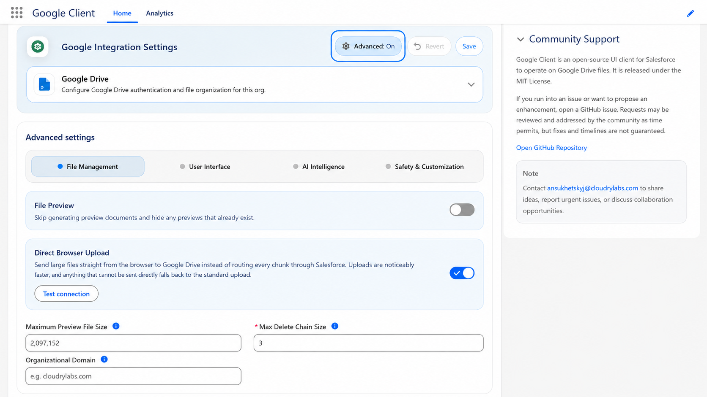

# Advanced Settings

Advanced settings live in the **Google Client** app, on their own screen, grouped into four tabs. Every one of them is optional.

A freshly installed package behaves exactly as documented without any of them being set, and leaving a field blank always means "use the default" — never "unset" or "broken". The same is true after an upgrade: a setting added in a new release starts out blank and keeps the behavior you already had until you choose otherwise.

## Opening Them

1. Open the **Google Client** app from the App Launcher
2. Go to the **Home** page
3. Select **Advanced**

## The Four Tabs

- **[File Management](advanced/file-management.md)**

    Preview, upload transport, file size, deletion behavior, and the domain that public links are restricted to.

- **[User Interface](advanced/user-interface.md)**

    Which columns appear in File Explorer, in what order, including your own fields.

- **[AI Intelligence](advanced/ai-intelligence.md)**

    Turn File Intelligence on, and control the prompts and answer length used for summaries and questions.

- **[Safety & Customization](advanced/safety-customization.md)**

    How strictly AI questions and answers are inspected, and how to replace that inspection with your own.

## Looking for Something Else?

A few settings people expect to find here live elsewhere, because they belong to a setup step rather than to fine-tuning:

- [Folder Structure](folder-structure.md) — organizing uploads in Drive by user, by record, or both
- [Multiple Upload Folders](multiple-drives.md) — adding fallback destinations for when a drive fills up
- [Configure Google Workspace](../setup/configure-drive.md) — the service account, the certificate, the upload folder, and the custom authorizer class
- [Configure AI & Intelligence](../setup/configure-intelligence.md) — connecting Gemini or the Agent Platform

 
