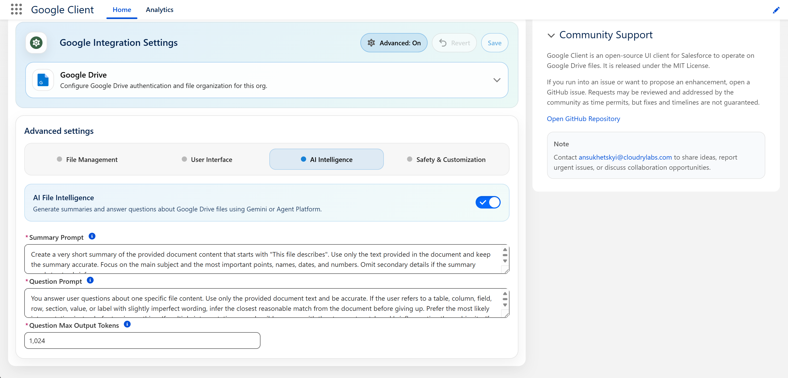

# Advanced: AI Intelligence

Turn File Intelligence on, and control how the AI provider is asked to respond.

Open the **Google Client** app → **Advanced** → **AI Intelligence**.

!!! note
    These settings only take effect once a provider is connected. Start with [Configure AI & Intelligence](../../setup/configure-intelligence.md) if you have not done that yet.

## AI File Intelligence

The master switch for summaries and file Q&A.

When it is off, Google Drive file operations continue to work normally and the AI controls are simply not shown. Nothing is sent to any AI provider. Turning it back on makes the feature available again — existing summaries are not lost while it is off.

The three settings below are disabled until this is on, and required once it is.

## Summary Prompt

How the provider is asked to describe a file.

The shipped prompt asks for a very short summary starting with "This file describes", built only from the document text, focused on the main subject and the most important names, dates, and numbers.

Replace it when your teams need something else. A sales org might want commercial terms surfaced first; a support org might want the product and the reported issue. Be specific about the kind of business answer you expect, and resist adding ceremony — longer prompts do not produce better summaries.

📘 See [Document Summaries](../../features/artificial-intelligence/summaries.md)

## Question Prompt

How the provider is asked to answer a user's question about a file.

The shipped prompt asks for accurate, concise, plain-text answers drawn only from the document, and tells the model to make a sensible attempt at matching imperfect wording to the right table, column, or section before giving up. It also fixes the wording used when an answer genuinely is not in the file.

Change it if your users need a different tone or a different fallback, but keep the instruction to answer only from the document. Removing that is what turns a document assistant into a chatbot that guesses.

📘 See [File Q&A](../../features/artificial-intelligence/file-qa.md)

## Question Max Output Tokens

How long an answer may be.

This is the setting that most directly affects what your AI provider bills you, since you pay per answer and answers are the longer half of the exchange.

Raising it allows fuller answers to complex questions. Lowering it keeps answers terse and costs down, at the risk of a useful answer being cut short. If users report answers that stop mid-sentence, this is the setting to raise.

## Safety

Prompt inspection is configured on its own tab, because it applies to every prompt regardless of what you write above.

📘 See [Safety & Customization](safety-customization.md)

 
