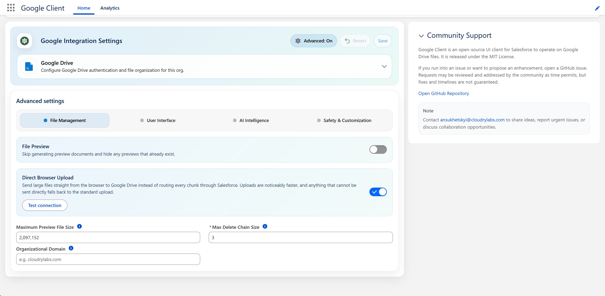
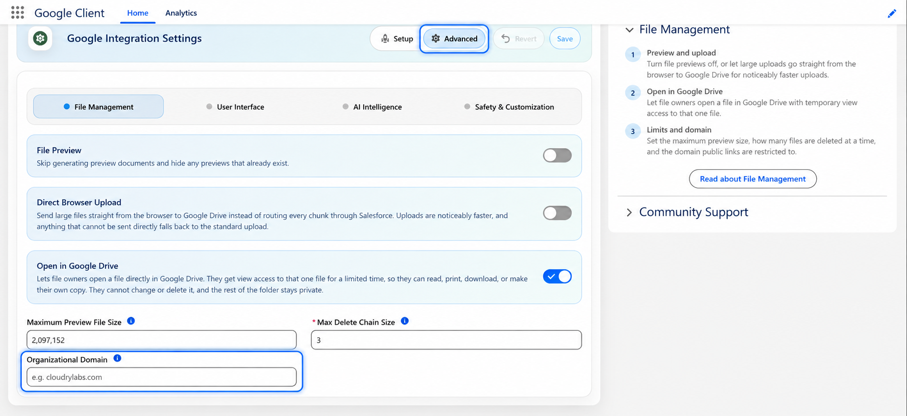

# Advanced: File Management

How files are previewed, transferred, and cleaned up, plus the domain that public links are restricted to.

Open the **Google Client** app → **Advanced** → **File Management**.

## File Preview

Turns off the in-Salesforce preview window across every Google Client component.

Files can still be uploaded, downloaded, shared, versioned, and linked to records. Only the preview experience is removed, and the preview action stops appearing rather than opening an empty window.

Leave this off unless your organization has a policy against rendering document content inside Salesforce. Turning it on also removes the place where AI summaries and file Q&A are shown, so those features become unreachable even when File Intelligence is enabled.

📘 See [Preview](../../features/preview.md)

## Direct Browser Upload

Sends large file content from the browser straight to Google Drive instead of routing every chunk through Salesforce, which makes large uploads noticeably faster.

It is **off by default**. Until you turn it on, uploads behave exactly as they always have. Once it is saved, a **Test connection** button appears that verifies the whole path without leaving a file in Google Drive.

📘 See [Direct Browser Upload](../direct-browser-upload.md) for what changes, what does not, and what happens when an upload cannot be sent directly.

## Open in Google Drive

Lets file owners open a file directly in Google Drive.

It is **off by default**. Until you turn it on, the option does not appear anywhere and files stay reachable only from Salesforce.

When it is on, only the **owner** of a file sees the option, and only if they are an internal user. Opening a file gives that person **view access to that one file**. Where your Google Drive supports timed access it lasts a week, extended each time they open the file again; where it doesn't, it stays until removed in Google Drive. They can read, print, download, and save their own copy.

📘 See [Open in Google Drive](../../features/open-in-drive.md)

## Maximum Preview File Size

The size, in bytes, above which a file is treated as a large upload and transferred in chunks rather than in one request. It also governs which files can be rendered by the large-file preview path.

The default is **2 MB** (`2097152`). Blank means the default is used.

PDFs are previewed regardless of this value.

Raising it is rarely useful. The chunked path exists because Salesforce limits how much data one operation can hold, and this setting does not change those limits — setting it too high produces errors rather than larger previews.

## Max Delete Chain Size

How many background jobs Google Client may queue when removing a file's content from Google Drive.

The default is **3**. Blank means the default is used.

A file with many versions needs more than one background job to remove every copy from Drive, because each job can only reach Google a limited number of times. Raising this lets very large files finish cleaning up sooner; lowering it reduces the number of queued jobs Google Client adds to your org.

## Organizational Domain

Controls the default reach of a public link.

When a domain is configured, the Public Link window shows a checkbox that decides who the link works for:

- **Unchecked (default)** — the link only opens for people signed in to that Google Workspace domain
- **Checked** — the link is global and opens for anyone who has it

When the field is blank, no checkbox appears and every public link is global. Set this if your organization expects shared documents to stay inside the company unless someone deliberately decides otherwise.

Enter the domain on its own, without a protocol or a path — for example `example.com`.

📘 See [Public Links](../../features/public-links.md)

 
