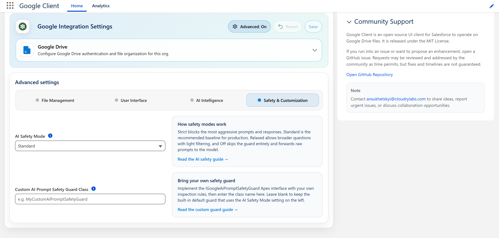

# Advanced: Safety & Customization

How strictly AI questions and answers are inspected, and how to replace that inspection with your own.

Open the **Google Client** app → **Advanced** → **Safety & Customization**.

!!! note
    Both settings apply only to File Intelligence and are disabled until it is enabled. They do not change how files are uploaded, previewed, shared, or stored.

## AI Safety Mode

Sets how strictly questions and answers are inspected.

| Mode | Questions | Answers |
|---|---|---|
| **Strict** | Checked, with a shorter length limit | Checked, and also rejected if the answer contains code blocks or links that are not in the document |
| **Standard** | Checked | Checked |
| **Relaxed** | Not checked | Checked |
| **Off** | Not checked | Not checked |

**Standard** is the default and applies when nothing is selected, including immediately after installation. It suits almost every organization, and we recommend leaving it in place.

Choose **Strict** when documents are regulated or confidential and you would rather occasionally refuse a fair question. Choose **Relaxed** if Standard is refusing legitimate questions your users need to ask, but you still want answers screened.

!!! warning
    **Off** removes the only barrier between a user's typed input and the AI provider. Use it to isolate a problem, then put it back.

📘 See [AI Prompt Security](../../features/artificial-intelligence/safety.md) for what each check actually does and why.

## Custom AI Prompt Safety Guard Class

Replaces the shipped inspection with your own Apex class.

Leave it blank to use the shipped one, which is what almost every org should do. Fill it in when you have content rules of your own — a confidentiality list, an internal classification scheme, a compliance vocabulary — that the shipped inspection cannot know about.

Enter the class name only, without a namespace. If the class cannot be found or does not implement the required interface, Google Client falls back to the shipped inspection rather than leaving the feature unprotected.

!!! warning
    A custom class replaces the shipped inspection **entirely**, including the credential screening and the safety rules wrapped around your prompts. Whatever you still want, keep in your implementation.

📘 See [Bring Your Own Guard](../../features/artificial-intelligence/safety.md#ownguard) for the interface, a working example, and what to watch out for.

 
