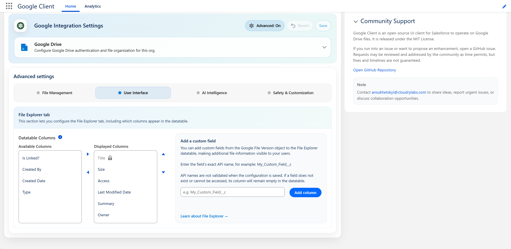

# Advanced: User Interface

Choose which columns appear in File Explorer and in what order.

Open the **Google Client** app → **Advanced** → **User Interface**.

## File Explorer Columns

Move columns from **Available Columns** to **Displayed Columns**, then drag them into the order you want.

| Column | Shows |
|---|---|
| **Title** | The file name, and the link users click to preview it |
| **Type** | The file format |
| **Size** | The file size |
| **Created By** | Who added the file to Salesforce |
| **Owner** | Who owns the file record, including when that is a group or a queue |
| **Created Date** | When the file was added |
| **Last Modified Date** | When the file was last changed |
| **Is Linked?** | Whether the file is attached to a Salesforce record |
| **Access** | The viewing user's own access level, View or Edit |
| **Summary** | The AI-generated description of the file |

Two rules apply:

- **Title is always displayed first** and cannot be removed, because it is what users click to open a file.
- **Up to 7 columns** can be displayed. Beyond that the table stops being readable, particularly on narrow screens.

Leaving the selection untouched keeps the standard set, which is what every org has today.

## Adding Your Own Field

Any field on the **Google File Version** object can be added as a column. Enter its exact API name — for example `My_Custom_Field__c` — in the **Add a custom field** box and select **Add column**.

!!! warning
    API names are **not validated when you save**. If the field does not exist, or the running user cannot read it, the column simply appears empty. It does not throw an error, and it does not stop the table from loading — so check the spelling before assuming the field is the problem.

Fields that hold sensitive data are never queried, even when named here.

!!! note
    Not every column can be sorted. Title, Is Linked?, Created By, Owner, and the two date columns can; Type, Size, Summary, Access, and custom fields are shown but not sortable.

📘 See [File Explorer](../../features/file-explorer.md) for how the tab behaves for end users.

 
