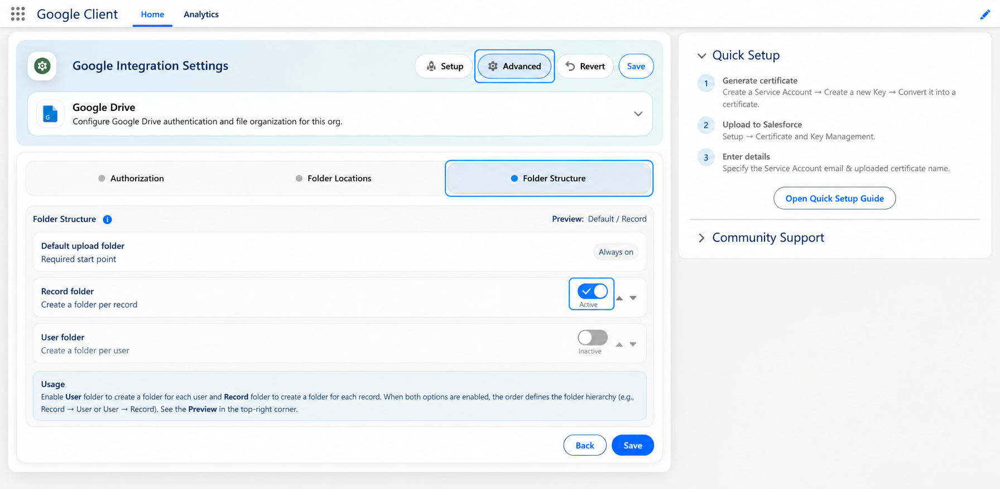
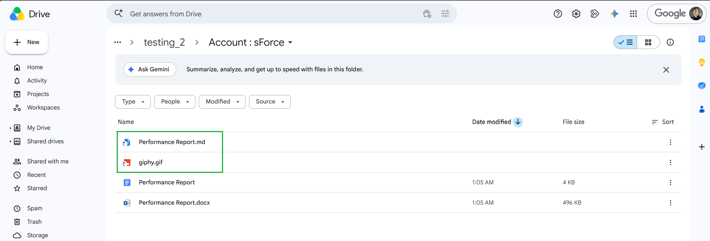
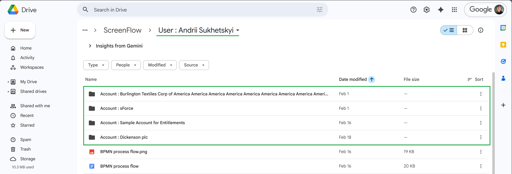

# Folder Structure

Folder Structure controls how Google Client organizes uploaded files in Google Drive. It lets you keep Drive clean and predictable by automatically placing files into the right folders based on your configuration.

## Where to Configure It

Folder Structure is configured in the **Google Client** Lightning app in Salesforce.

## Default Behavior

By default, Google Client uploads files into a **single Drive folder** (your **Default Upload Folder Id**) with **no additional structure**.

This is the simplest option and works well for small teams or proof-of-concepts.

## How Folder Structure Works

You can enable one or both structure levels:

- **User folder** — creates a folder per user
- **Record folder** — creates a folder per Salesforce record

You can also change the **order** of these levels (move them up/down) to define the hierarchy, for example:

- **Record → User** (a folder per record, then a folder per user inside)
- **User → Record** (a folder per user, then record folders inside)

The **Preview** in the configuration screen shows the resulting path.

## When It Applies

Folder Structure rules are applied whenever a file is uploaded through Google Client, including:

- Upload from record context
- Upload from preview window
- Upload from File Explorer
- Attach an existing Google Client file to another record, when the configured structure includes a record folder

In all cases, Google Client computes the target folder path and places the file accordingly.

When an existing file is attached to another record, Google Client keeps the original Drive file in place and creates a Google Drive shortcut in the resolved folder for the newly linked record.

Shortcut behavior depends on the configured structure:

| Folder Structure | Existing File Attachment Behavior |
|------------------|-----------------------------------|
| No folder structure / Default folder only | No shortcut is created |
| Folder per User | No shortcut is created |
| Folder per Record | Shortcut is created in the resolved record folder |
| Folder per User → Record | Shortcut is created in the resolved nested record folder |
| Folder per Record → User | Shortcut is created in the resolved nested user folder |

## Processing Time

The destination folder is resolved — and created when it does not exist yet — **once per upload**, while the files are transferring, so every file of the same upload shares one folder. Moving the uploaded file into that folder is still handled by an **asynchronous job**, so after upload or existing-file attachment it can take **around 1 minute** for the file, folder structure, or shortcut to appear in its final place in Google Drive.

!!! tip "Allocate Org Cache for reliable folder placement"

    A resolved folder is remembered in the **GoogleCloudClient** Platform Cache partition, because Google Drive search does not immediately return a folder that was just created. Orgs without purchased or trial cache receive **0 storage** for that partition, which disables the memory and can lead to duplicated record folders under heavy concurrent uploads.

    Set **Org Cache** to at least `1` MB in **Setup → Platform Cache → GoogleCloudClient**. See [Known Issues](../help/known-issues.md) for the full steps.

## How It Looks in Google Drive

 