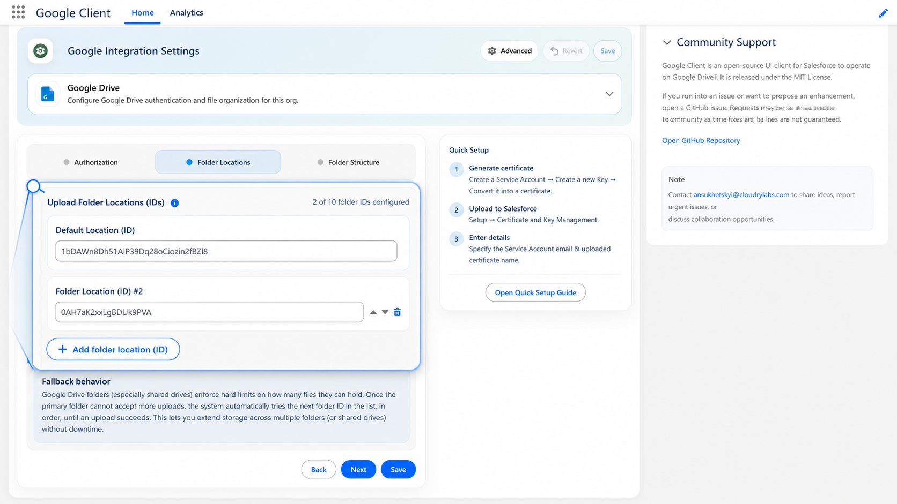

# Multiple Upload Folders

A single Google Drive or Shared Drive has hard limits on how much it can hold. When a drive reaches one of those limits, uploads into it stop working — no matter how much quota the service account itself has.

Google Client can be given more than one destination, so uploads keep working when that happens.

Most organizations never need this. Set it up when you are approaching a drive limit, or ahead of a migration that will move a large volume of files at once.

## Configuring the Folders

1. Open the **Google Client** app
2. Go to the Google Drive configuration step
3. Add folders under **Folder Locations**

Up to **ten** folders can be configured, and the order matters.

## How the Order Is Used

1. The **first** folder in the list is the primary destination. Everything is uploaded there while it has room.
2. If Google rejects an upload because the drive or folder is full, Google Client automatically retries into the **next** folder in the list, and continues down the list until one accepts the file.
3. Whichever folder accepted the file becomes the root for that upload. Any configured [Folder Structure](folder-structure.md) — user folders, record folders, or both — is created inside that folder.

Users are not told any of this happened. The upload simply succeeds.

## What Counts as "Full"

Moving to the next folder is triggered only by Google's hard capacity errors: a shared drive reaching its item limit, the storage quota being exhausted, or a folder reaching the maximum number of children.

Ordinary failures — a bad file, an expired token, a network problem — are **not** treated as capacity problems. They are reported to the user as errors instead of silently moving the file somewhere else, because moving the file would not have fixed them.

## Choosing the Folders

!!! tip
    Use folders on **separate Shared Drives** rather than several folders on the same drive. Most capacity limits apply to the drive as a whole, so an extra folder on a drive that is already full will not accept uploads either.

!!! note
    Files already stored in an earlier folder are never moved. This only affects where **new** uploads are placed, so a record can end up with files in more than one drive over time. Each file keeps its own location, and every Google Client component continues to find it.

## Planning Ahead

Because files are never relocated, the value of this setting comes from configuring it *before* you need it. A second folder added the day the first drive fills up works fine, but the period between the drive filling and someone noticing is the period where uploads fail.

If your organization stores a high volume of files, add a second destination as part of the initial setup and leave it empty.

📘 See [Configure Google Workspace](../setup/configure-drive.md) for the rest of the Drive configuration.

 
