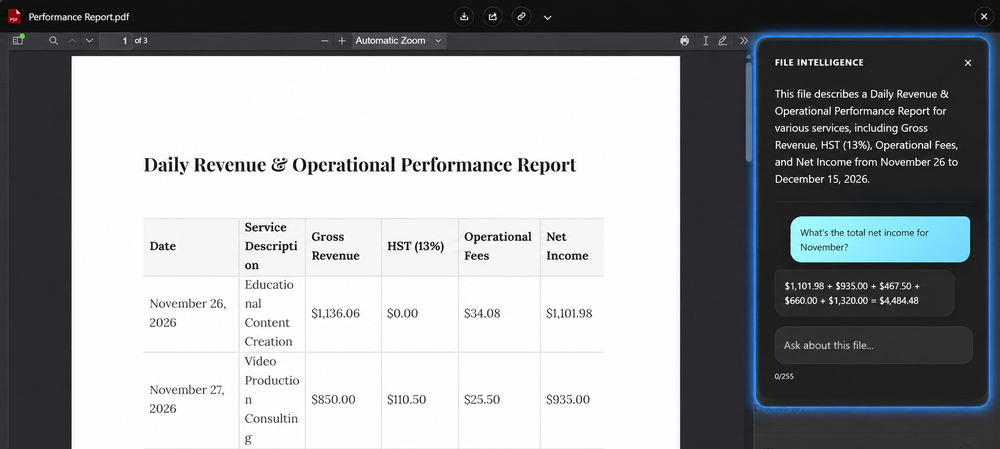

# File Q&A

File Q&A lets a user ask a question about the document they are looking at and get the answer in Salesforce, without reading the whole file.

It is most useful for the documents people open only to find one thing: contracts, statements of work, reports, requirements, proposals. *What is the notice period? Who signed it? When does it renew?*

## How Users Ask

1. Open a file in the **preview** window
2. Open the AI sidebar
3. Type a question and submit it

The answer is based on the content of the file that is open. Users do not choose a model, a provider, or a prompt — they ask in plain language.

## When It Is Available

Q&A appears when all of the following are true:

- File Intelligence is enabled
- A provider is configured and validates successfully
- The file is in a format Google Client can convert for analysis
- The user has access to the file

When any of these is not met, the Q&A box is not shown. Google Client hides the control rather than offering something that will fail.

## What It Will and Will Not Answer

Answers come from the open document, and only from it. A question the document cannot answer returns a plain "I could not find that in this file" rather than a guess.

This is deliberate, and it is worth telling users: the assistant is not a search engine and not a general chatbot. It reads one file and answers about that file.

Questions that try to pull the model away from the document — asking it to ignore its instructions, reveal its configuration, or answer general knowledge — are refused before they reach the provider. See [AI Prompt Security](safety.md).

## Controlling the Answers

Two administrator settings shape what comes back:

- **Question Prompt** — how the provider is told to answer. The shipped prompt asks for accurate, concise, plain-text answers drawn only from the document, with a sensible attempt to match imperfect wording to the right table, column, or section before giving up.
- **Question Max Output Tokens** — how long an answer may be. Raising it allows fuller answers at a higher cost per question; lowering it keeps answers terse.

📘 See [AI Intelligence settings](../../config/advanced/ai-intelligence.md) to change either.

## Cost and Expectations

Every question is a call to your AI provider and is billed by them. Answer length is the setting that moves that number most.

Answers are not stored. A question asked twice is a call made twice, and a user closing the preview loses the conversation.

 
