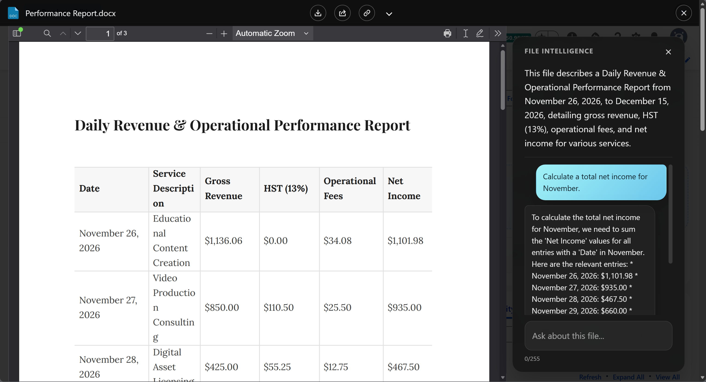

# AI & Intelligence

Google Client includes an optional AI layer that helps people understand documents without leaving Salesforce — and without opening them.

It does two things: it writes a short summary of every file, and it answers questions about the file a user is looking at.

## What It Adds

- **[Document Summaries](summaries.md)**

    A short description of what each file contains, generated in the background and stored in Salesforce, so users can tell files apart from a list.

- **[File Q&A](file-qa.md)**

    Ask a question about the open document and get the answer in the preview window, instead of reading the whole file to find one clause.

## How It Works

Google Client analyzes a converted copy of the file rather than the original upload, which is how a Word document, a spreadsheet, and a PDF can all be handled the same way. The original file in Google Drive is never modified.

Summaries are generated in the background after an upload, so nobody waits for one. Questions are answered on demand while the preview is open.

Everything goes to the AI provider **you** configure, in **your** Google account, and nowhere else. Google Client does not run a model of its own and does not route content through any third party.

## What Is Protected

Every question is inspected before it leaves Salesforce, and every answer before it is shown. This protects against attempts to talk the model out of its instructions — asking it to ignore its rules, reveal its configuration, or answer about something other than the open file — and against answers that leak a credential or invent personal data.

The protection is on from the moment File Intelligence is enabled, at a **Standard** strictness that suits most organizations. It can be tightened, loosened, or replaced with your own Apex implementation.

📘 See [AI Prompt Security](safety.md) for the modes and the extension point.

## Choosing a Provider

| | Gemini Developer API | Agent Platform |
|---|---|---|
| **Authentication** | An API key from Google AI Studio | The service account already used for Drive |
| **Google Cloud project** | Not required | Required, with billing active |
| **Best for** | Development, sandboxes, internal evaluation | UAT and production |

Both provide the same features. Agent Platform is the stronger enterprise fit because it puts AI usage under the same Google Cloud project controls, billing, and audit as the rest of your integration.

## It Is Optional

The core Google Drive experience does not depend on AI. Upload, preview, download, sharing, public links, folder structure, file reuse, and versioning all work exactly the same when File Intelligence is disabled or was never configured — the AI controls are simply not shown.

## Where to Go Next

- [Configure AI & Intelligence](../../setup/configure-intelligence.md) — connect a provider
- [AI Intelligence settings](../../config/advanced/ai-intelligence.md) — prompts and answer length
- [Safety & Customization](../../config/advanced/safety-customization.md) — the safety mode setting

 
