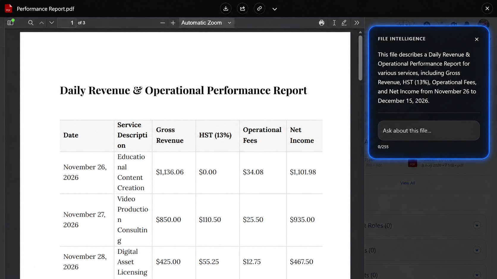

# Document Summaries

A summary is a short, business-facing description of what a file contains. It is generated once, stored in Salesforce on the file version, and shown wherever a user needs to know what a document is without opening it.

## Where Summaries Appear

- In the **preview** window, in the sidebar next to the document
- On **hover** experiences, where the file name alone is not enough to tell files apart
- As a **File Explorer column**, if an administrator adds the Summary column

Because the summary is stored on the file version, it is available everywhere a Salesforce field is available — including list views, reports, and your own components.

## When a Summary Is Generated

A summary is generated in the background after a file is uploaded or a new version is added. Users are not made to wait for it.

Every new version gets its own summary. The summary describes that specific revision, so replacing a contract with a revised copy gives you a summary of the revision, not of the original.

The file must be in a format Google Client can convert for analysis. Documents, spreadsheets, presentations, and PDFs are summarized; a video file or an archive is not.

## Controlling the Wording

The summary prompt is an administrator setting, so the output can match how your organization talks about its documents.

The shipped prompt asks for a very short summary beginning with "This file describes", focused on the main subject and the most important names, dates, and numbers. Replace it if your teams need something different — a sales org might want the commercial terms surfaced first, a support org the product and the reported issue.

📘 See [AI Intelligence settings](../../config/advanced/ai-intelligence.md) to change the prompt.

Keep prompts specific and practical. The best prompts tell the provider what kind of business answer your users expect, without adding unnecessary ceremony.

## What Happens When It Cannot Be Generated

Nothing breaks. If the provider is not configured, the file cannot be converted, or the call fails, the file simply has no summary and every other part of Google Client continues to work. Users see the file exactly as they would with File Intelligence turned off.

Failures are recorded through the logging framework and are visible to administrators on the Analytics dashboard.

## Privacy

Generating a summary sends the document content to the AI provider you configured, and to no one else. The request passes through the same protections as a user question — see [AI Prompt Security](safety.md).

 
