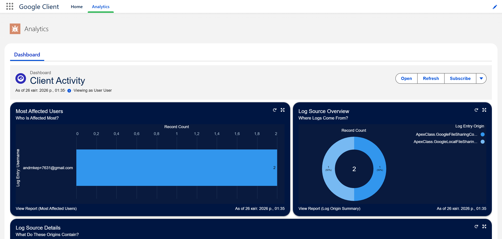

# Audit & Logging

Google Client gives administrators visibility into what is happening with files, both inside Salesforce and on the Google side.

## Salesforce Logging

All significant actions taken through Google Client are captured using [**Nebula Logger**](https://github.com/jongpie/NebulaLogger){ target="_blank" rel="noopener noreferrer" }. This includes uploads, shares, access attempts, version changes, and any errors that occur.

Logs are stored inside Salesforce and visible to administrators without any third-party tooling.

## Analytics Tab

The **Google Client** application includes a dedicated **Analytics** tab. It surfaces a built-in Salesforce dashboard that gives administrators a quick view of activity, errors, and usage patterns based on the captured log data — all without leaving the app.

## Google Workspace Audit Visibility

On the Google side, all file activity is tracked through standard Google Workspace tooling. Administrators can use the **Google Admin Console** and **Drive Audit Logs** to review file access events, sharing changes, and security alerts.

## Why This Matters

Between the Salesforce logs, the Analytics dashboard, and the Google-side audit trail, administrators have a complete picture of how files are accessed and managed. This supports compliance requirements, helps detect unexpected access, and provides a clear trace for any regulated operation.

 