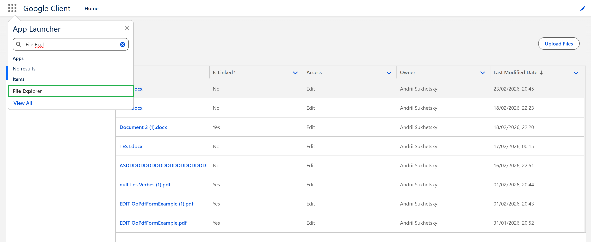

# File Explorer

The **File Explorer** is a Lightning tab that lets users browse Google Drive files from Salesforce in a clean and fast User Interface.

## How to Open It

1. In Salesforce, go to **App Launcher**
2. Search for **File Explorer**
3. Open the tab

To see the tab, the user must have the permission set **Google Cloud Client User**.

## What This Tab Contains

The File Explorer has two views:

- **Owned by Me** — files where you are the Google Drive owner
- **Shared with Me** — files shared with you (primarily via direct user/group sharing)

## File List Columns

By default, the table shows your accessible files with key details such as:

- **Title**
- **Is Linked?** — whether the file is linked (assigned) to a Salesforce record
- **Access** — your effective access level (View/Edit)
- **Owner**
- **Last Modified Date**

### Configuring Columns

Administrators can tailor which columns appear, and in what order, from the **Google Client** app → setup wizard → **Advanced → User Interface**.

- Pick columns from the built-in catalog — **Title**, **Type**, **Size**, **Created By**, **Owner**, **Created Date**, **Last Modified Date**, **Is Linked?**, **Access**, and **Summary** (the AI-generated file summary) — and drag to reorder them.
- **Title** is always displayed first and cannot be removed, because it is the link users click to preview a file.
- A maximum of **7** columns can be displayed.

Need a field that isn't in the catalog? Enter any **Google File Version** field API name (for example, `Summary__c`) in the **Add a custom field** box. Custom entries are **not** validated when you save — enter the exact API name. If the field does not exist or cannot be read, its column simply appears empty instead of causing an error.

## Searching Files

Use the **Search** box in the File Explorer header to filter the current view. The search matches on the **file name** and, when present, the file's **Summary** — so you can find a document by what it contains even if you do not remember its exact name. Files without a summary continue to match by name.

Beyond the File Explorer, Google Files can also be found through Salesforce **global search**. Opening a file from a global search result takes you straight to its **File Details** page. Global search follows Salesforce's standard sharing (files you own or that are directly shared with you), while the File Explorer also shows files you can reach through record-based access.

## Loading Large File Lists

The file list loads **progressively**: an initial set of rows is shown right away, and more rows are appended automatically as you scroll toward the bottom of the table. This keeps the tab responsive when you have access to a large number of files. Searching, filtering, and sorting always apply across **all** of your files.

## Uploading Files from File Explorer

You can upload files using **Upload Files**. However, any file uploaded from this tab will be **not linked to any Salesforce record** (**Is Linked? = No**).

 