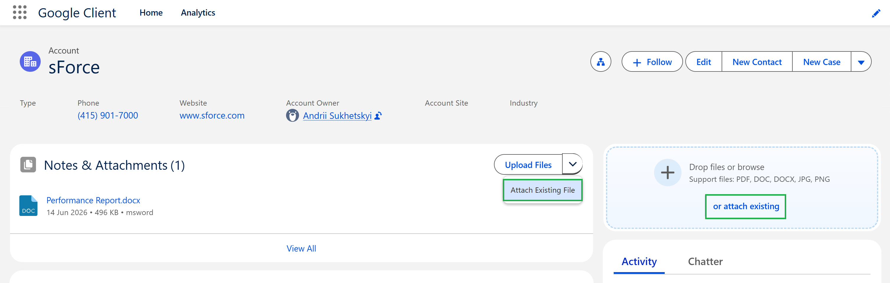
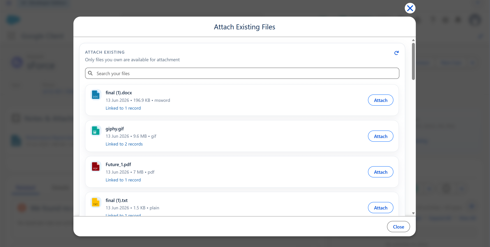
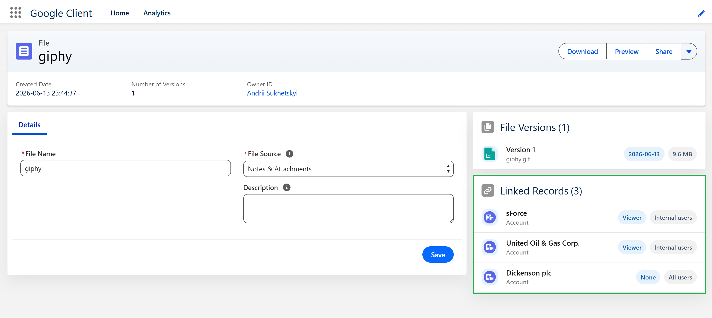

# File Reuse & Linked Records

Google Client lets users attach an existing Google Client file to more than one Salesforce record. The file remains a single Google Drive file and a single Google Client file record, while Salesforce keeps separate record links for each business context.

This is useful when the same document belongs to several records, for example a contract connected to an Account and an Opportunity, a specification reused across Cases, or an approval document tied to more than one custom record.

## What Users Can Do

From supported record components, users can:

- Upload a new Google Drive file to the current Salesforce record
- Attach one of their existing Google Client files to the current Salesforce record
- Reuse the same file across multiple Salesforce records without uploading duplicate copies
- Open the file details page and see the records currently linked to that file
- Preview, download, share, and version the file through the same Salesforce interface

## Where It Is Available

Attach Existing File is available from these record-based experiences:

- **Google Client: Attachments**
- **Google Client: Uploader**
- Related attachments views where Google Client opens files from a record context

The action requires a Salesforce record context. Files uploaded directly from File Explorer are standalone until they are attached to a record.

## Ownership Boundary

The Attach Existing Files selector shows files owned by the current user.

This keeps ownership predictable. A user can reuse their own Google Client files, but they cannot take another owner’s file and attach it to an unrelated business record through this flow.

Google Client also checks that the user can read the target Salesforce record before the file is attached to it.

## How Linked Records Work

When a file is attached to a Salesforce record, Google Client creates a file link for that record. In 2.0.0, a file can have more than one valid record link.

The result is simple:

- The Google Drive file is not duplicated
- The Google Client file record is not duplicated
- Each Salesforce record gets its own link to the same file
- Each link can participate in access calculation
- File details can show the records linked to the file, subject to the current user’s record access

## Google Drive Folder Alignment

If Folder Structure includes a record folder, Google Client keeps Google Drive aligned when an existing file is attached to another record.

The original Google Drive file stays in place. Google Client creates a Google Drive shortcut in the resolved folder for the newly linked record. This gives users a Drive structure that reflects Salesforce record usage without creating duplicate files.

Shortcuts are created only for structures that include a record folder:

- **Folder per Record**
- **Folder per User -> Record**
- **Folder per Record -> User**

No shortcut is created for the default folder-only structure or Folder per User only.

## Access Behavior

Each linked record can be an access path, but only when the current user has the required Salesforce record access and the file link grants access through its Share Type.

If a file is linked to Record A and Record B, a user with access to Record A can access the file through Record A. A user with access only to unrelated Record C cannot see or act on the file through that unrelated record.

For the full security model, see [Security & Access Model](../security.md).

## Cleanup Behavior

When a Google Client file is deleted, Google Client removes the related Salesforce record associations for that file. This prevents deleted files from continuing to appear through old record links.

 