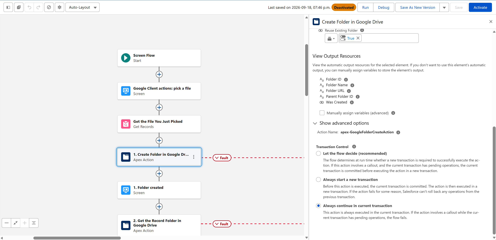
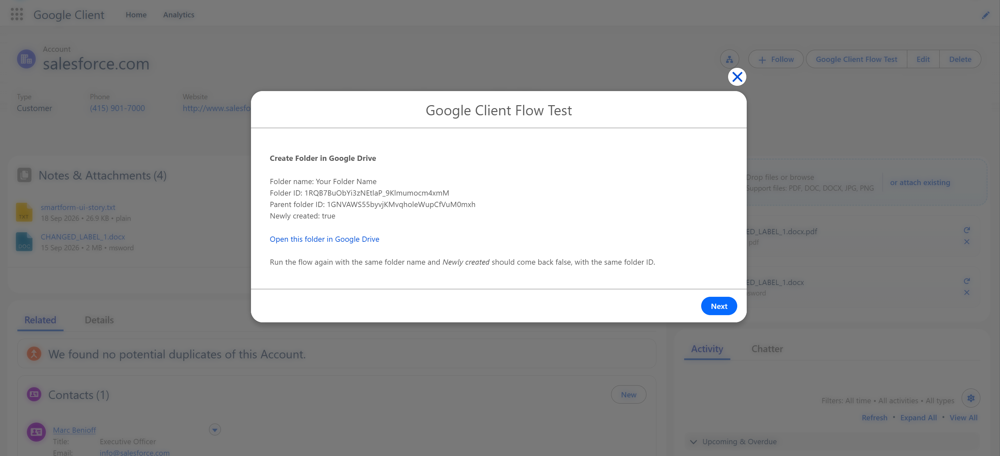

# Create Folder in Google Drive

**Type:** Action, listed under the **Google Client** category in Flow Builder.

Creates a folder in Google Drive from a flow. The action looks for a folder with the same name in the same place first and returns that one instead of creating a duplicate, so a flow that runs twice does not leave two folders behind.

The same action also hands back the folder a record already owns, which is how a flow gets a link to a record's folder without creating anything new.

## When To Use It

- Give every new record its own folder as soon as the record exists, and store the link on the record.
- Prepare a folder for a set of files before uploading them, so they all land in one place.
- Look up the folder a record already owns, to put its link in an email or on a page.

## How To Add It To A Flow

1. Open **Flow Builder** in Salesforce Setup.
2. Create a flow, or open an existing one.
3. Add an **Action** element.
4. Choose the **Google Client** category and select **Create Folder in Google Drive**.
5. Enter a **Folder Name**, or leave it blank and supply a **Record ID** to get that record's own folder instead.
6. Set **Parent Folder ID** if the folder has to go somewhere specific.
7. Save and activate the flow.

## Inputs

| Input | Required | Description |
|---|---|---|
| **Folder Name** | No | Name of the folder to create. Leave blank, together with a Record ID, to get the record's own Google Drive folder instead of creating a new one. |
| **Parent Folder ID** | No | Google Drive folder the new folder is created in. Leave blank to use the record's folder when a Record ID is given, or the default upload folder otherwise. |
| **Record ID** | No | The Salesforce record whose Google Drive folder is used as the parent. With Folder Name blank, that record folder is what the action returns. |
| **Reuse Existing Folder** | No | On by default. Turn off to always create a new folder, even when one with that name is already there. |

## Outputs

| Output | Description |
|---|---|
| **Folder ID** | The Google Drive ID of the folder |
| **Folder Name** | The folder's name in Google Drive |
| **Parent Folder ID** | The folder it sits in |
| **Folder URL** | A link that opens the folder in Google Drive |
| **Was Created** | True when a new folder was created, false when an existing one was returned |

## Where The Folder Goes

The action picks the parent in this order:

1. **Parent Folder ID**, when you supply one.
2. The **Record ID**'s own folder, when the folder structure keeps a folder per record.
3. The default upload folder configured for Google Client.

## Returning A Record's Own Folder

Leave **Folder Name** blank and pass only a **Record ID**. The action returns that record's folder, creating it if nothing has needed it yet, and **Was Created** tells you which of the two happened.

This needs a [folder structure](../../config/folder-structure.md) that includes a **Record folder**. Without one there is no per-record folder to return, and the action says so instead of guessing.

!!! note
    Needs Google Drive [configured](../../setup/configure-drive.md). In a record triggered flow, place the action on an **asynchronous path**, and connect a **Fault** path to catch `{!$Flow.FaultMessage}`.

📘 See [Upload File to Google Drive](upload-file-action.md) to put files into the folder it gives back.

 
