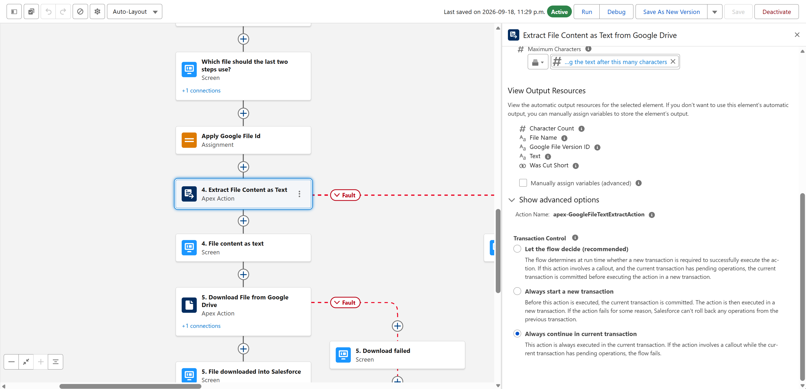
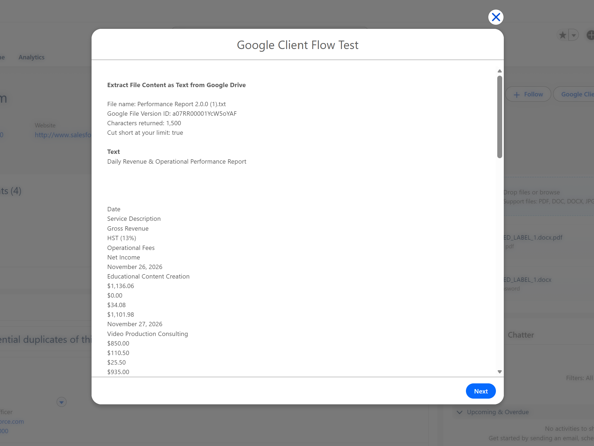

# Extract File Content as Text from Google Drive

**Type:** Action, listed under the **Google Client** category in Flow Builder.

Reads the content of a Google Client file as plain text, so the rest of the flow can work with what the file actually says.

## When To Use It

- Feed a document into a prompt template so a model can answer questions about it.
- Check whether a file contains specific wording before the flow continues.
- Copy part of a document onto a record field.

## How To Add It To A Flow

1. Open **Flow Builder** in Salesforce Setup.
2. Create a flow, or open an existing one.
3. Add an **Action** element.
4. Choose the **Google Client** category and select **Extract File Content as Text from Google Drive**.
5. Set either **Google File ID** or **Google File Version ID**.
6. Set **Maximum Characters** if you only need the beginning of the file.
7. Save and activate the flow.

## Inputs

| Input | Required | Description |
|---|---|---|
| **Google File Version ID** | One of the two | The exact version to read. |
| **Google File ID** | One of the two | The file whose latest version is read when no version is given. |
| **Maximum Characters** | No | Cuts the text after this many characters. Leave blank to return everything. |

## Outputs

| Output | Description |
|---|---|
| **Text** | The file content as plain text |
| **Character Count** | How many characters were returned |
| **Was Cut Short** | True when the text was cut at Maximum Characters |
| **Google File Version ID**, **File Name** | The version that was read |

## Which Files Can Be Read

Text comes from the preview copy Google Client prepares for documents, spreadsheets, PDFs and images, so it is available for every file type that can be previewed.

Plain text files such as `.txt`, `.csv` and `.md` are read straight from the upload and are ready the moment the file arrives.

## When Text Is Not Ready Yet

For a file uploaded moments earlier the preview copy may still be preparing. The action reports that text is not available yet, which is deliberately different from reporting that the file is empty.

In a flow that uploads a file and then reads it, put the two in separate runs, or wait for the preview to be ready before reading. A record-triggered flow on an **asynchronous path** usually gives Google enough time on its own.

Use **Maximum Characters** when the text feeds a prompt. It keeps the flow clear of the limits on how much text one element can hold, and **Was Cut Short** tells you whether anything was left behind.

!!! note
    Needs Google Drive [configured](../../setup/configure-drive.md). In a record triggered flow, place the action on an **asynchronous path**, and connect a **Fault** path to catch `{!$Flow.FaultMessage}`.

📘 See [Download File from Google Drive](download-file-action.md) to save the file in Salesforce instead.

 
