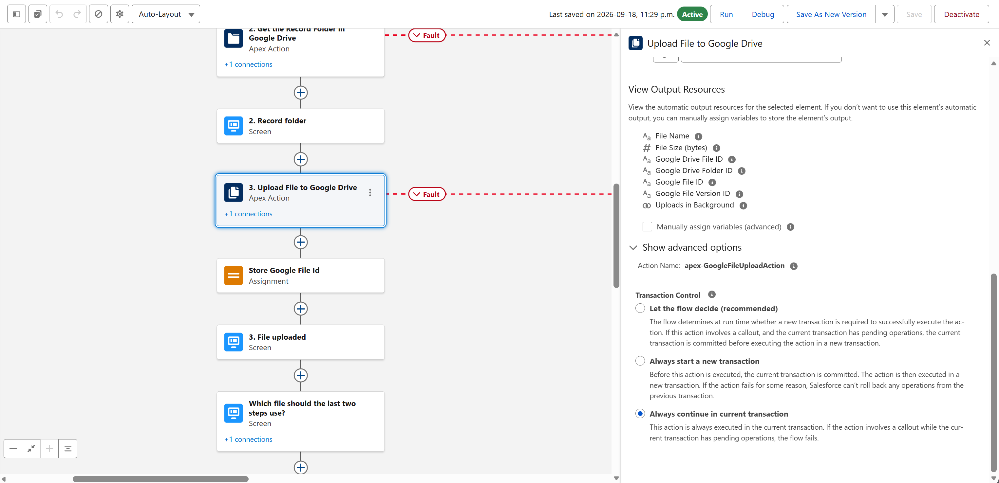
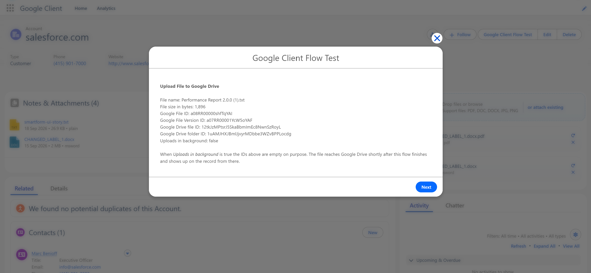

# Upload File to Google Drive

**Type:** Action, listed under the **Google Client** category in Flow Builder.

Takes a file that already lives in Salesforce, such as one added through the standard **File Upload** screen component or attached to a record, and moves it into Google Drive as a Google Client file.

The result behaves exactly like a file uploaded through the Google Client components. It is placed in the configured folder structure, a preview and a summary are prepared, and it shows up on the record.

## When To Use It

- Send files a customer submitted through a screen flow or a form straight into Google Drive.
- Move files that were attached to a record before Google Client was installed.
- Keep Salesforce storage free by uploading a file and removing the Salesforce copy in the same step.

## How To Add It To A Flow

1. Open **Flow Builder** in Salesforce Setup.
2. Create a flow, or open an existing one.
3. Add an **Action** element.
4. Choose the **Google Client** category and select **Upload File to Google Drive**.
5. Set **Salesforce File ID** to the file you want to send. In a screen flow this is the output of the standard **File Upload** component.
6. Set **Record ID** so the file appears on that record, and pick **Shown In** to match the component your users look at.
7. Save and activate the flow.

## Inputs

| Input | Required | Description |
|---|---|---|
| **Salesforce File ID** | Yes | The Salesforce file to send, as a Content Document ID or a Content Version ID. The standard File Upload screen component provides both. |
| **Record ID** | No | The record the file is attached to in Salesforce. Leave blank to keep the file unattached. |
| **File Name** | No | A different name for the file. The original extension is kept. |
| **Shown In** | No | Where the file appears on the record: `Notes & Attachments` (default), `Uploader` or `File Explorer`. Match it to the component your users look at. |
| **Remove Salesforce Copy** | No | Off by default. Turn on to delete the Salesforce file once it is safely in Google Drive, which is how a flow keeps Salesforce storage free. |

## Outputs

| Output | Description |
|---|---|
| **Google File ID** | The Google Client file record |
| **Google File Version ID** | The version that holds the uploaded content |
| **Google Drive File ID** | The file's ID in Google Drive |
| **Google Drive Folder ID** | The Google Drive folder the file landed in |
| **File Name**, **File Size (bytes)** | What was uploaded |
| **Uploads in Background** | True when the file is large and finishes uploading after the flow, in which case the IDs above are empty |

## Small And Large Files

Files up to the **Maximum Preview File Size** setting are uploaded before the action finishes, and the outputs carry the new IDs right away.

Larger files are handed to a background upload that completes shortly after the flow, with **Uploads in Background** set to true and the IDs empty. Either way the file appears on the record once it is in Google Drive.

If the rest of your flow needs the IDs, check **Uploads in Background** first and take a different path when it is true.

Files are moved through Salesforce, which limits how large a single file can be. A few megabytes works well. Anything much larger belongs in the Google Client components, which send it from the browser instead.

## Where The File Lands

The upload follows the same [folder structure](../../config/folder-structure.md) as every other upload, so a file attached to a record ends up in that record's folder. Placement finishes moments after the upload, which is why **Google Drive Folder ID** can name the default upload folder rather than the record folder.

!!! note
    Needs Google Drive [configured](../../setup/configure-drive.md). In a record triggered flow, place the action on an **asynchronous path**, and connect a **Fault** path to catch `{!$Flow.FaultMessage}`.

📘 See [Uploader in Screen Flows](uploader-screen-flows.md) to collect files from a person instead.

 
