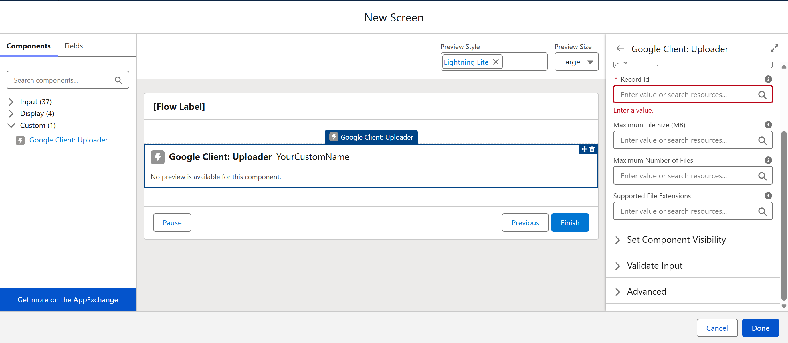

# Uploader in Screen Flows

The Google Client Uploader component can be placed directly inside a Salesforce **Screen Flow**. This lets you collect file uploads as part of any guided process, such as a case intake form, an onboarding checklist, or a document submission step — all without writing code.

Files uploaded through the flow go straight to Google Drive and are linked to the record you specify, just like any other upload in Google Client.

## How to Add It to a Flow

1. Open **Flow Builder** in Salesforce Setup.
2. Create a new Screen Flow, or open an existing one.
3. Add a **Screen** element to your flow.
4. Inside the screen, search for **Google Client: Uploader** in the component list and add it.
5. Set the **Record Id** property. This tells the component which Salesforce record the uploaded files will be linked to. In most cases you will pass a flow variable or the `{!recordId}` from the record context.
6. Configure any optional constraints (see below).
7. Save and activate the flow.

## Component Properties

| Property | Required | Description |
|---|---|---|
| **Record Id** | Yes | The Salesforce record the uploaded files will be linked to. |
| **Supported File Extensions** | No | Comma-separated list of allowed extensions (for example: `PDF, DOCX, PNG`). Leave blank to allow all types. |
| **Maximum File Size (MB)** | No | Reject files above this size. Leave blank for no limit. |
| **Allow Multiple Files** | Yes | Set to `true` to allow uploading several files at once, or `false` to restrict to one at a time. Defaults to `true`. |
| **Maximum Number of Files** | No | Cap the total number of files a user can upload in one session. Leave blank for no limit. |

## What Happens After Upload

Once a file is uploaded, it is immediately sent to Google Drive and linked to the specified record. The user can see the file listed in the uploader, preview it, or delete it before moving to the next screen in the flow. All the same access controls and folder structure rules that apply elsewhere in Google Client apply here too.

 
