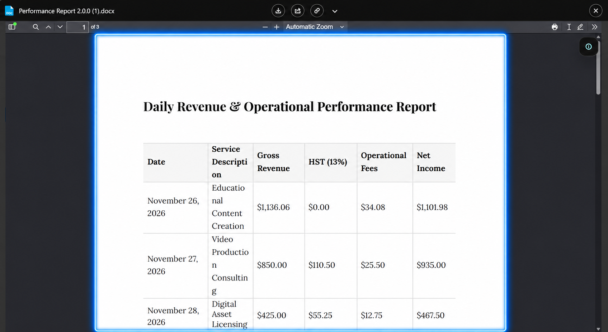

# Preview

The preview window is the central interface for file interaction inside Salesforce. It is available to both **Viewer** and **Collaborator** users.

## Supported File Types

The preview window supports the following file types:

- PDF documents (any size, see note below)
- Microsoft Word (`.docx`, `.doc`)
- Images (`.png`, `.jpg`, `.gif`)
- Spreadsheets (`.xlsx`, `.csv`)

**A note on file size:** PDF files are always previewable, regardless of how large they are. For all other supported types, preview is available up to the **Maximum Preview File Size** limit configured in the Google Client settings. Files above that limit can still be downloaded, but will not render an inline preview.

If a file type is not supported, the window still opens with a message and all available actions.

## Available Actions

Within the preview window, users can:

- View the file
- Fill out or annotate PDF files
- Add custom text or drawings
- Sign documents
- Print the file
- Download the file
- Open Collaboration Tools (Share / Public Link / Versioning / etc)

This provides a modern document experience directly in Salesforce without storing files there.

## Entry Points

No matter which component is used (Records, Lists, Experience Cloud), clicking on a file opens the preview window.

It is intentionally designed as the **main access point** for all file-related functionality.

 