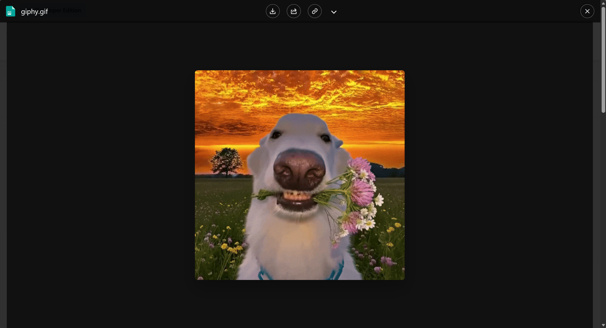
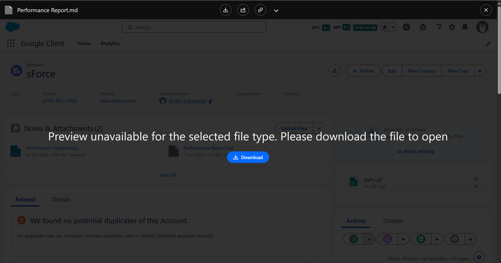
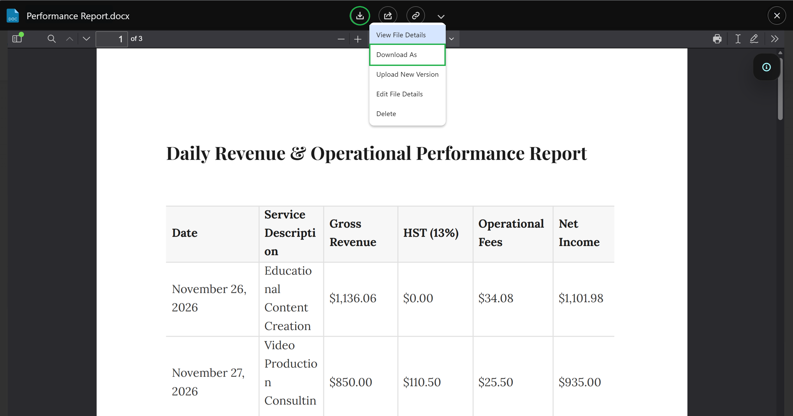

# Preview

The preview window is the main workspace for Google Client files inside Salesforce. Users open it from record components, File Explorer, View All pages, and Experience Cloud where the user has access.

## What It Supports

Google Client supports a broad Salesforce-native preview experience while the actual files remain in Google Drive.

Supported preview behavior includes:

- PDF preview, including large PDF files
- Direct image preview, including large image files
- CSV and spreadsheet preview
- Document preview for supported document types
- Non-previewable file handling with a clear download option
- Version-aware preview, so the expected active version is used
- Optional AI summary and Q&A panel when File Intelligence is configured

## File Size Behavior

PDF and supported image files can be previewed directly. Other previewable document and spreadsheet files depend on the configured **Maximum Preview File Size** and on Google Client preparing a Google Workspace preview version.

If a file cannot be previewed, the preview window still opens and gives users the available actions, including download.

## Download and Download As

Users can always download the original file when they have access.

For supported previewable files, the preview menu also shows **Download As**. This lets users export the prepared Google Workspace preview into another format without opening Google Drive.

Supported export options depend on the generated preview type:

- Document-style previews can export to Microsoft Word, PDF, OpenDocument, plain text, rich text, zipped HTML, EPUB, and Markdown.
- Spreadsheet-style previews can export to Microsoft Excel, OpenDocument Spreadsheet, PDF, zipped HTML, CSV, and TSV.

If Download As is not supported for the selected file, the action is hidden.

## Available Actions

Depending on the user’s access level, the preview window can provide:

- Download
- Download As
- Share
- Public Link
- View File Details
- Edit File Details
- Upload New Version
- Delete
- AI summary and file Q&A, when configured and available

Viewer users get read-oriented actions. Collaborator and owner users can access edit-oriented actions where allowed.

## AI Panel

When File Intelligence is enabled and the file is eligible, the preview window can show a side panel with the stored document summary and a question-answering experience.

This keeps document understanding inside Salesforce. Users do not need to download the file or open a separate AI tool just to understand what a document contains.

 