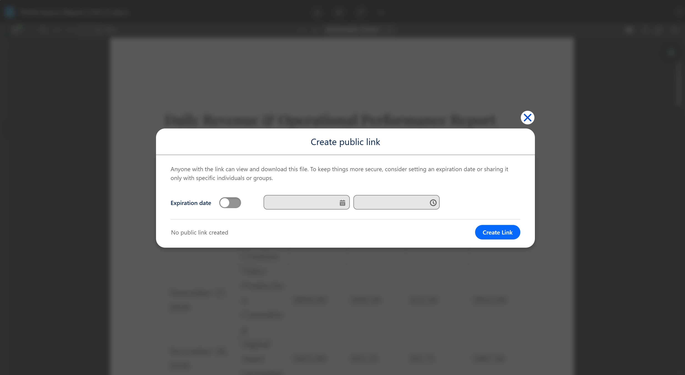

# Public Link Creation

Public links allow users with **Collaboration Access** to share files with people who do **not** have Salesforce access.

This is useful for:

- Contractors
- External partners
- Vendors
- Email-based collaboration

## How It Works

Public links:

- Are created from Salesforce
- Can include an expiration date
- Require **no** Salesforce login to access
- Open in a **Google Drive view** in a separate tab

## Organization-Domain Restriction (Optional)

For enterprise usage, you can restrict public links to your **organization’s domain** (for example, `cloudrylabs.com`). When enabled, the link remains shareable, but **only users signed in under that domain** can open it.

This setting is configured in the **Google Client** application and is stored in **Custom Metadata**.

## Creating a Public Link

1. Open a file
2. File opens in the **Preview Window**
3. Click the **Public Link** button (third button on toolbar)
4. Set an expiration date (recommended)
5. Create the link

After creation, you will receive a URL that can be copied and shared immediately.

## Access Behavior

- Recipients view the file through Google Drive
- Access can be revoked at any time
- Expired links delete automatically
- If **Organization-Domain Restriction** is enabled, recipients outside your domain will be blocked

This feature gives you the flexibility of external sharing **without increasing Salesforce license count**.

 