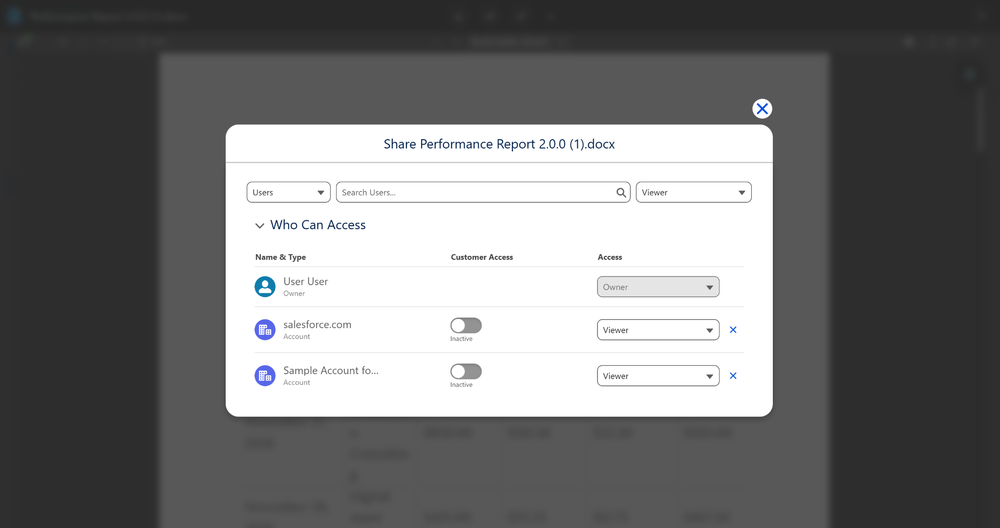
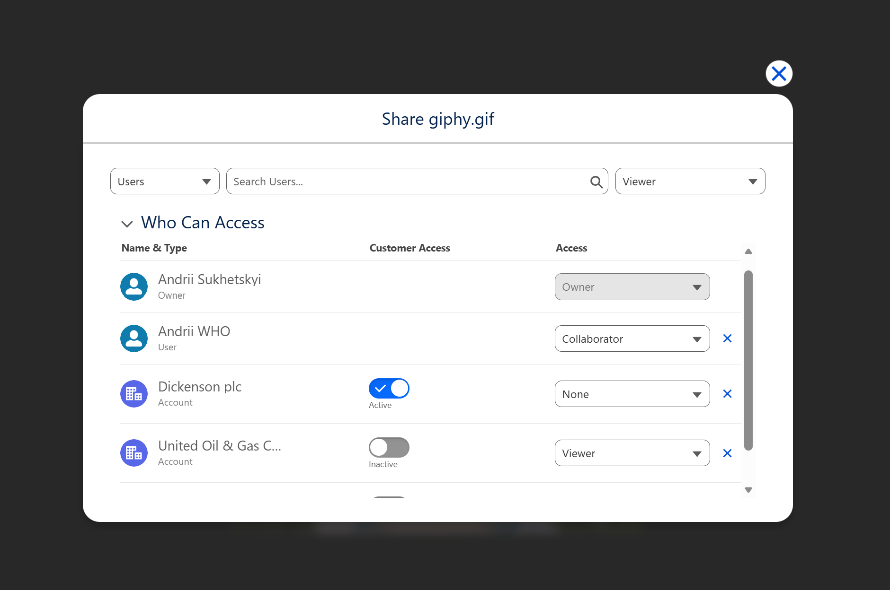

# Sharing

File sharing enables collaboration within your Salesforce organization without using Salesforce Files as storage.

In Google Client, sharing is controlled through **two separate access paths**:

1. **Direct Sharing** (share with a user / group / queue)  
2. **Record Link Access** (assign the file to a Salesforce record and define what that link grants)

The security layer combines both paths and applies the **highest** access level the user qualifies for.

In 2.0.0, a file can be linked to more than one Salesforce record. Each valid record link can participate in access calculation, which makes file reuse practical without losing security control.

## How to Open Sharing

1. Open a file in Salesforce.
2. The file opens in the **Preview Window**.
3. Click the **Share** button (second button on the toolbar).

## 1) Direct Sharing (People & Groups)

Users with **Collaboration Access** can share files directly with:

- Internal Users
- Public Groups
- Queues (work distribution scenarios)
- Customer Community Users (where applicable)

**Note:** For collaborators, some sharing actions may be restricted and require the file owner to make the change, please keep this in mind.

### Access Levels (Direct Sharing)

- **Viewer** — read-only: view or download  
- **Collaborator** — full access: view, modify, upload new versions  

## 2) Record Link Access (Files Assigned to Records)

A file can be **assigned to a Salesforce record** (Account, Case, Opportunity, etc.).  
This creates a **File Link**, and each link has a **Share Type** that defines what access the record relationship can grant.

The same file can have multiple File Links. This means one Google Drive file can appear on several Salesforce records without uploading duplicate copies.

### Share Type (Record Link)

| Share Type         | Behavior                                                                 |
|-------------------|--------------------------------------------------------------------------|
| **None**          | Grants **no access** through the record link (link is kept for traceability) |
| **Viewer**        | Grants **View** access (if the user can see the record)                  |
| **Set by Record** | Access is derived from record permissions (Edit → full, Read → read-only) |

## How Access Is Calculated

For any file, the system evaluates:

- Ownership
- Direct shares (user / group / queue)
- All valid record links and their Share Type
- Internal vs external user rules

If multiple rules apply, the Google Client security layer chooses the **highest** access level.

Record links do not expose a file through unrelated records. A user must have a valid access path through ownership, direct sharing, public link rules, or one of the linked records.

 