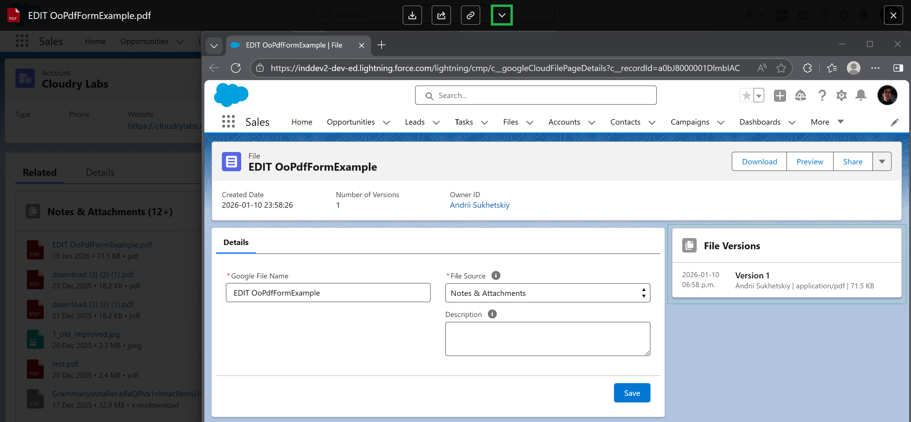

# Versioning

File versioning ensures that updates to a file do not overwrite history. Users with **Collaboration Access** can upload new versions of a file at any time.

## How Versioning Works

When a collaborator uploads a new version:

- The newest version becomes the **active** one
- Previous versions are retained for audit and review
- Access permissions are preserved

## Viewing Previous Versions

To view older versions:

1. Open the **File Record Page**
2. Locate the **Versions** panel
3. Select any version to preview or download

This approach prevents data loss, improves collaboration, and supports regulated environments where file history matters.

 