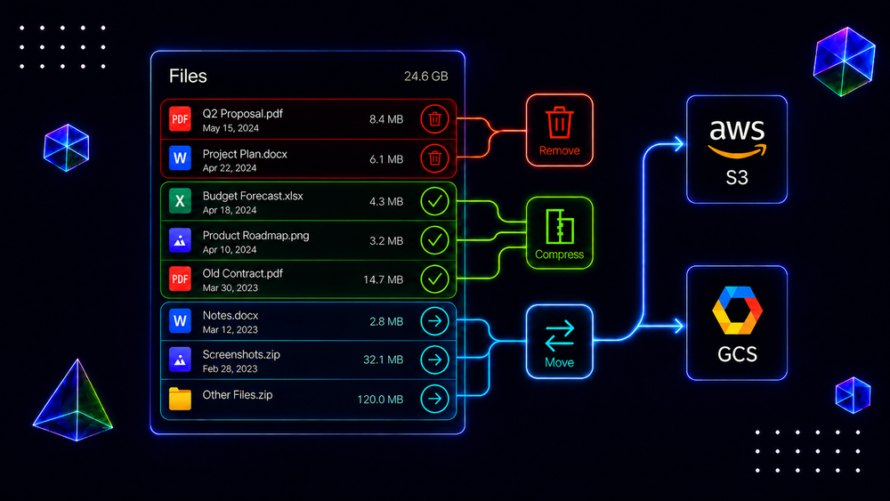

# Articles

## A Practical Guide to Salesforce File Storage Optimization

[{ .article-cover }](https://www.bulkifiedthinking.com/practical-guide-to-salesforce-file-storage-optimization/){ target="_blank" rel="noopener noreferrer" }

A general playbook for orgs running out of Salesforce file storage: find what is actually consuming it, clear out old files and versions, compress what has to stay, and move the rest to external storage. It is not about Google Client — it is the wider problem Google Client is one answer to.

[Read the article](https://www.bulkifiedthinking.com/practical-guide-to-salesforce-file-storage-optimization/){ target="_blank" rel="noopener noreferrer" }

 
