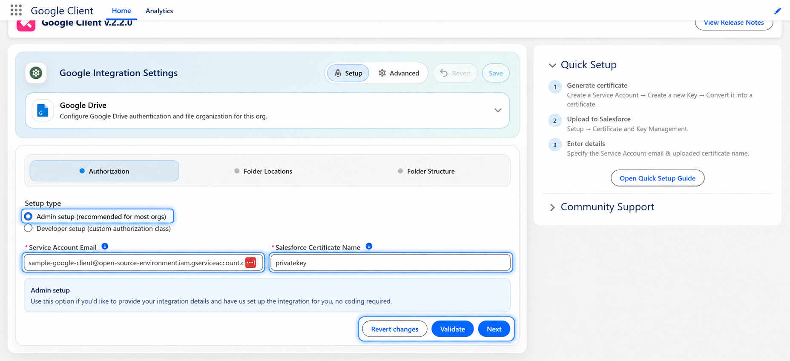
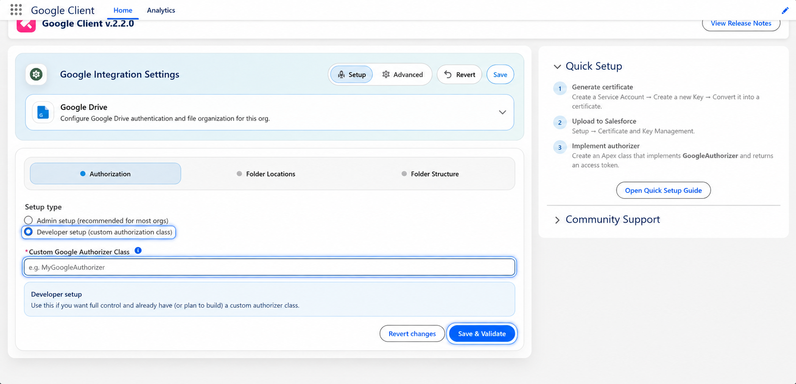

# Configure Google Workspace

This guide walks through configuring the **Google Workspace (Drive)** connection inside the Google Client app. This is the minimum required integration, it enables all file management features: upload, preview, sharing, versioning, and folder structure automation.

!!! note
    Haven't installed the package yet? Start here: [Install & Upgrade](../install-overview.md)

## Before you begin

Before configuring the application, the administrator must grant themselves access to the app.

### Step 1: Assign Admin Permissions

1. Assign the **Google Cloud Client Admin** permission set to your user.
2. This permission grants access to the **Google Client** application and configuration features.

### Step 2: Open the Google Client Application

After permissions are assigned:

1. Open the **Google Client** application from the App Launcher.
2. You will land on the **Home** page, which displays:

<ul>
  <li>Current configuration status</li>
  <li>Authentication setup details</li>
  <li>Validation messages for missing or incomplete settings</li>
</ul>

### Step 3: Configure Authentication

Google Client supports two authentication setup options:

1. **Admin setup (recommended for most orgs)**, no Apex coding required
2. **Developer setup (custom authorizer class)**, for advanced or fully custom scenarios

Both options require that you already uploaded a **Salesforce certificate** (JKS) as described on the [Configure Certificate](configure-certificate.md) page, and that you know your **Service Account email**.

#### Option A: Admin Setup (No Code)

Use this option if you want to configure authentication through the UI:

1. Select **Admin setup (recommended for most orgs)**
2. Enter the **Service Account Email**
3. Enter the **Salesforce Certificate Name** (the certificate you uploaded earlier)
4. Click **Save & Validate**

#### Option B: Developer Setup (Custom Authorizer Class)

Use this option if you need a custom token strategy or want to fully control authorization in Apex:

1. Select **Developer setup (custom authorization class)**
2. Create an Apex class that implements the library’s authorization contract
3. Reference the class in the **Custom Google Authorizer Class** field
4. Click **Save & Validate**

📘 Reference documentation: [Library Authorization Flow](https://github.com/sandriiy/salesforce-google-drive-library/wiki/Library-Authorization-Flow){ target="_blank" rel="noopener noreferrer" }

📘 Certificate setup (use the certificate created earlier): [Configure Certificate](configure-certificate.md)

### Step 4: Complete Application Configuration

After authentication is configured:

1. Provide the **Google Drive Folder ID**.
2. Leave all other settings unchanged unless you have specific requirements.

### Recommended Folder Strategy

- Use a **Shared Drive** for centralized, team-managed access.
- Maintain a dedicated root folder per environment (**Dev / UAT / Prod**).

!!! note
  Google Workspace is now configured. If you'd like to add document summaries and file Q&A, you can also set up the AI & Intelligence layer: [Configure AI & Intelligence](configure-intelligence.md)

 