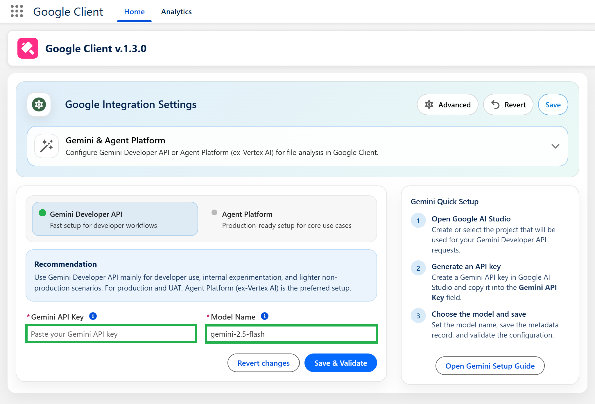
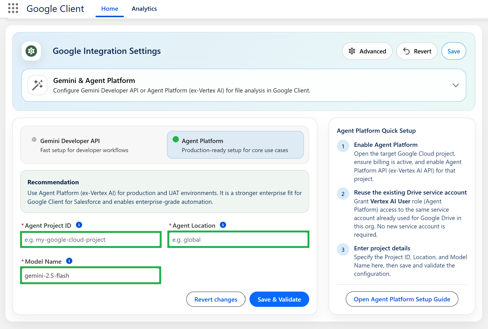

# Configure AI & Intelligence

This guide walks through configuring the **AI & Intelligence** layer inside the Google Client app. Once set up, it enables AI-powered features for files stored in Google Drive: smart analysis, automated labeling, policy checks, and audit insights.

!!! note
    Haven't configured Google Drive yet? That step is required first: [Configure Google Workspace](configure-drive.md)

## Before you begin

AI & Intelligence is an optional layer on top of the Google Drive integration. You must have Google Drive already configured and working before proceeding.

### Step 1: Open the Google Client Application

1. Open the **Google Client** application from the App Launcher.
2. Navigate to the **Home** page.
3. Expand the **Gemini & Agent Platform** section under **Google Integration Settings**.

### Step 2: Choose an Integration Method

Google Client supports two ways to connect to Google's AI services:

1. **Gemini Developer API**, API key-based setup, ideal for developer workflows and non-production environments
2. **Agent Platform** (Gemini Enterprise Agent Platform, formerly Vertex AI), service account-based setup, recommended for production and UAT

#### Option A: Gemini Developer API

Use this option for quick setup in developer or sandbox environments. Authentication is handled through an API key generated in Google AI Studio. No Google Cloud project configuration is required.

**When to use:** Internal experimentation, developer workflows, and lighter non-production scenarios.

1. Select **Gemini Developer API**
2. Go to [Google AI Studio](https://aistudio.google.com/apikey){ target="_blank" rel="noopener noreferrer" } and create or select a project
3. Generate a **Gemini API Key**
4. Paste the key into the **Gemini API Key** field
5. Set the **Model Name** (e.g. `gemini-2.5-flash`)
6. Click **Save & Validate**

#### Option B: Agent Platform (Gemini Enterprise Agent Platform)

Use this option for production and UAT environments. Authentication uses the **same Google Cloud service account** already configured for Google Drive, no new service account is required. You only need to grant it the **Vertex AI User** role on the target project.

**When to use:** Production and UAT environments. It is a stronger enterprise fit for Google Client and enables enterprise-grade AI automation.

1. Select **Agent Platform**
2. In the [Google Cloud Console](https://console.cloud.google.com/){ target="_blank" rel="noopener noreferrer" }, open the target project, ensure billing is active, and enable the **Vertex AI API** for that project
3. Grant the existing Drive service account the **Vertex AI User** role on that project
4. Enter the **Agent Project ID** (your Google Cloud project ID, e.g. `my-google-cloud-project`)
5. Enter the **Agent Location** (the region where the model runs, e.g. `us-central1` or `global`)
6. Set the **Model Name** (e.g. `gemini-2.5-flash`)
7. Click **Save & Validate**

 
